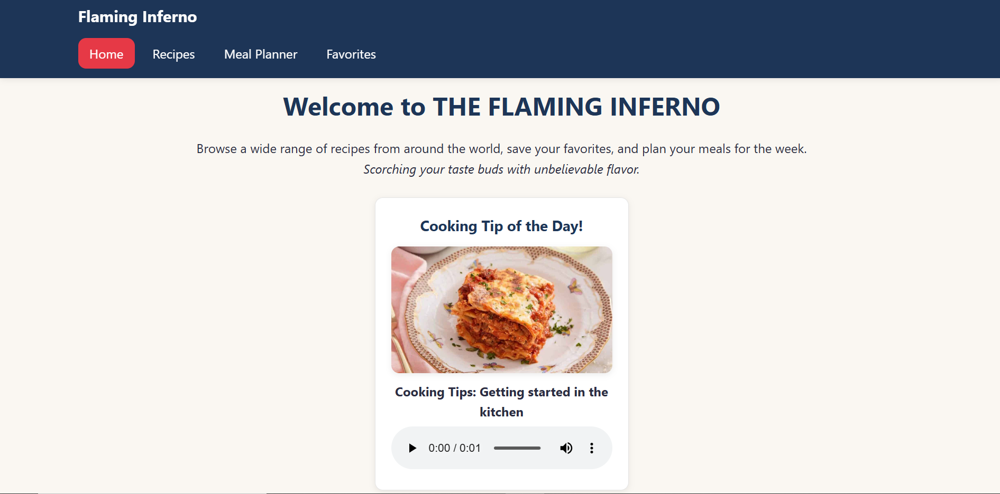
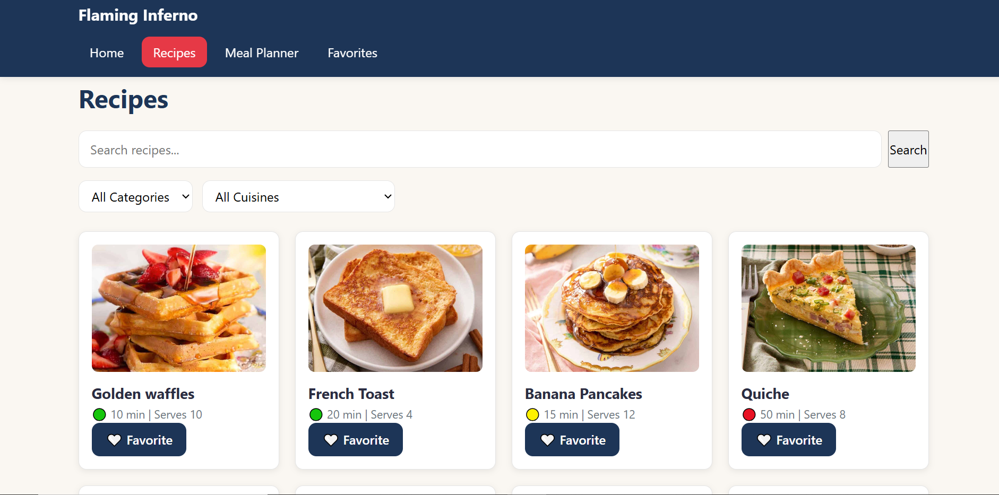
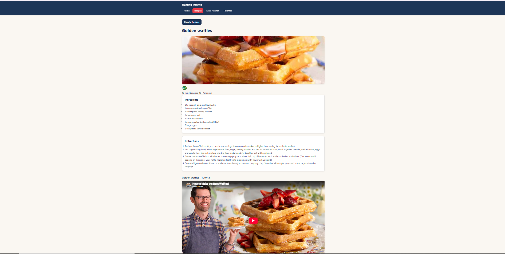
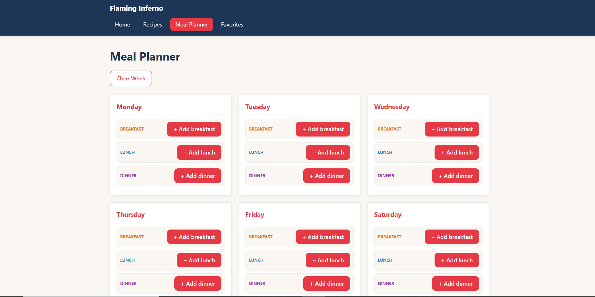
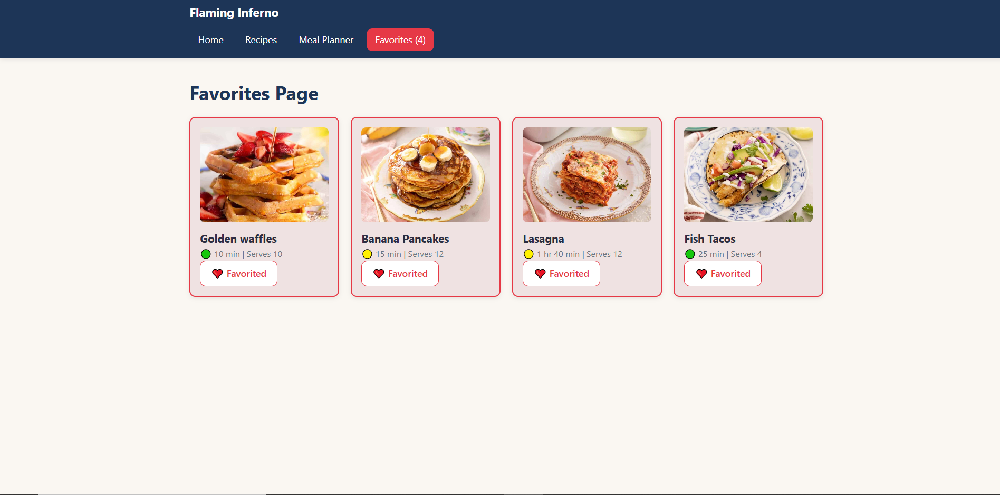
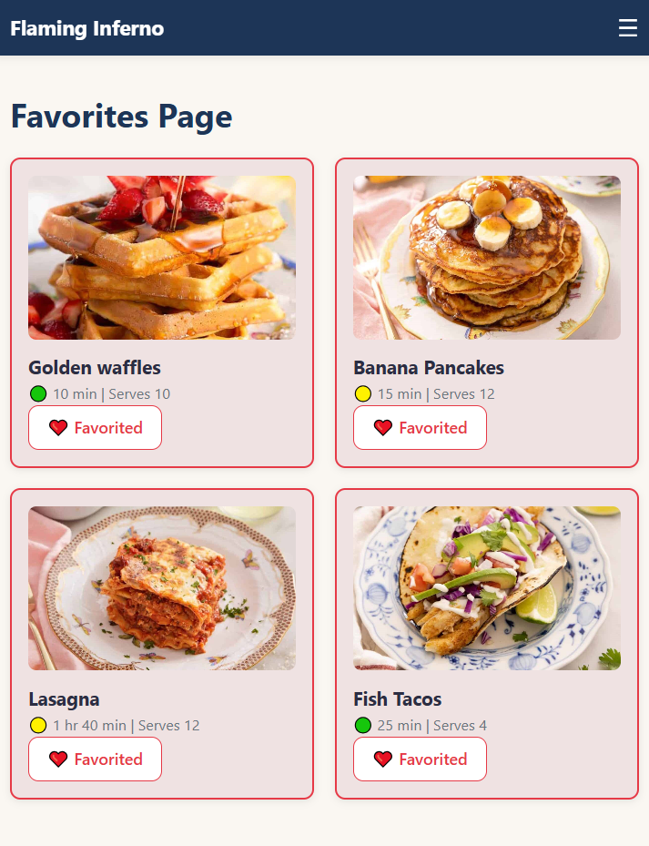
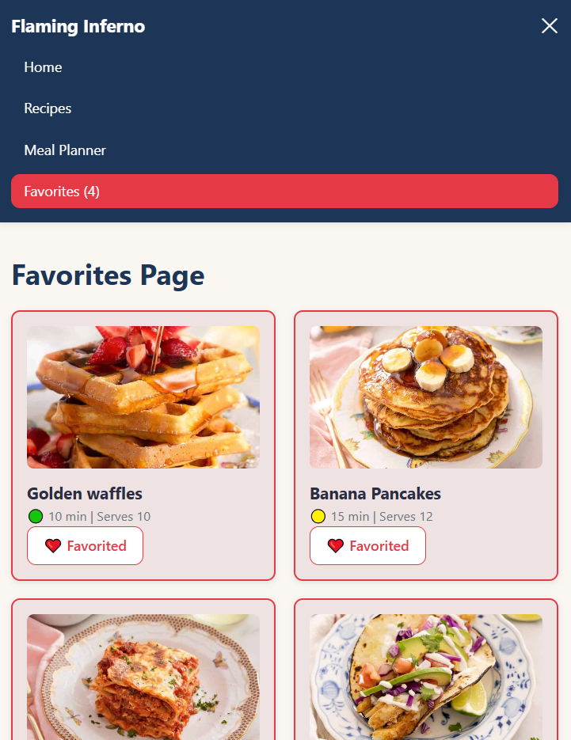

## 🔥THE FLAMING INFERNO🔥Recipe App
Welcome to my single-page recipe app, built with React and Vite. Users can browse a selection on the finest recipes sourced from sites like "The Preppy Chef", Ntsako T on YouTube and a few others. They can view the full recipe details, watch a YouTube tutorial, save their favorite and plan meals for the whole week.

THE FLAMING INFERNO: Scorching your tastebuds with unbelievable flavor!

## Features List:
1. Recipe catalog- 18 recipes for breakfast, lunch, dinner, dessert, and snacks, each with an image, cook time, difficulty level and servings
2. Search Bar- search for the recipe you're looking for using the title
3. Filter Bar- filter according to category and cuisine
4. Simulated loading state- simulated delay which shows a spinner
5. Recipe Detail page- shows an image of the dish, step-by-step instructions as well as an embedded video tutorial(Youtube links are embedded using iframe)
6. Favorites-heart button which allows you to favorite and unfavorite
7. Meal Planner- Monday to Sunday meal planning for three meals of the day
8. Responsive navigation- navbar collapses into hamburger menu
9. 404 page- for unmatched routes

## Technologies Used:
1. React
2. React Router DOM(BrowserRouter, nested routes, useParams, useNavigate, useLocation)
3. Proptypes
4. Vite
5. CSS Module
6. ESLint

## Component Architecture:

## Installation Instructions:
# Step 1:
Clone repo into your Vs Code

# Step 2:
In your terminal, navigate to the right file using "cd react-recipe-app-Maddyno1/recipe-app"

# Step 3:
In your terminal run "npm install" and then "npm start" OR "npm run dev"

## Project Structure:
Folder organization explanation

## Component Descriptions:
Brief description of each major component

## State Management:
How state flows through the application

## Routing:
Explanation of all routes

## Future Enhancements:
Ideas for additional features

## Screenshots:
Home page

